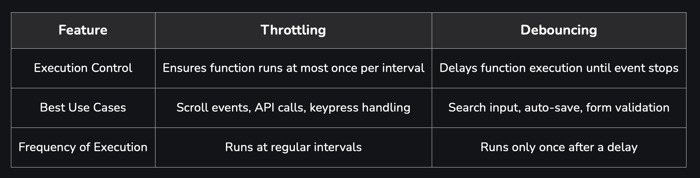

# INSIGHTS :

1. Throttle is basically keep delaying the next execution for the specified amount of delay.
2. if user is typing, wait till there is a gap of "delay" between last and current trigger
3. Does not matter if user keeps typing, once this delay is over, take the latest "value" as throttled value
4. Basically you are tracking if the gap between the last and latest trigger is more than the delay. If yes then take the latest value as throttled valeu, reset the datTime to the currentTime and move on

How Throttling Works
Throttling works by restricting the execution of a function so that it runs at most once every predefined period, even if the event is triggered multiple times within that interval.

A function is triggered multiple times due to an event (e.g., scroll, resize).
Throttling ensures that the function executes only once within the defined interval.
Any additional triggers during the interval are ignored until the next cycle starts.
Once the interval is over, the function can execute again if triggered.

# Requirements :

1. Create a react hook to implement throttle
2. It should take in a value and return the throttled value
3. It should take in the delay
4. Also allow to pass a callback method to be called once throttle is complete